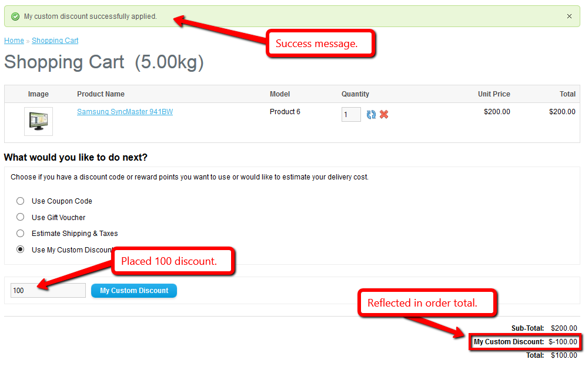
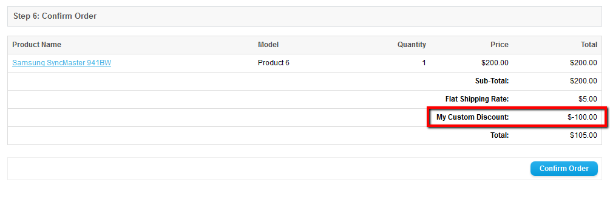
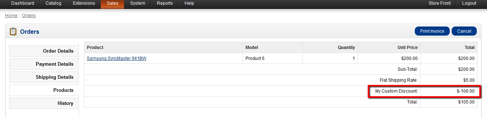
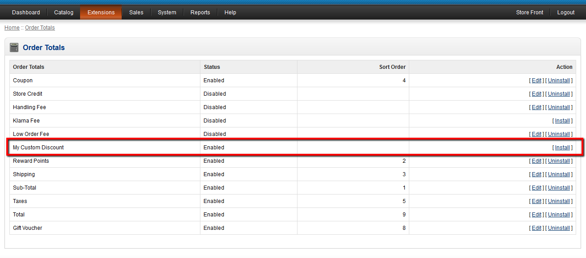
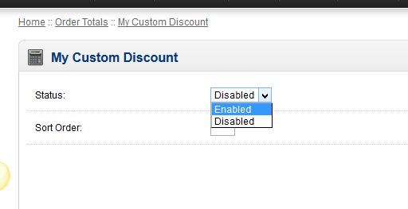

# opencart-custom-discount
Implementing your own (custom) discount extension in OpenCart e-Commerce Solution.

# Files to ADD:
<b>Note:</b>You can use any name for your custom discount extension. In this example, I used <b>my_custom_discount</b>.
  
admin/view/template/total/<b>my_custom_discount.tpl</b> 
admin/controller/total/<b>my_custom_discount.php</b> 
admin/language/english/total/<b>my_custom_discount.php</b> 
 
catalog/model/total/<b>my_custom_discount.php</b> 
catalog/language/english/total/<b>my_custom_discount.php</b>

# Files to EDIT:
<b>Note:</b> For the sake of this example, files I have edited are core files.
As a good practice, you should edit files properly by the use of <i>vQmod</i> and by making your own theme for the template file.
This is advisable when you are updating your OpenCart version constantly.
  
1. If you changed the name of the "admin" folder, then place admin files accordingly. 
2. If you created your own theme, then just copy the changes made from <b>catalog/view/theme/default/template/checkout/cart.tpl</b>. 
3. If you're using vQmod, implement the changes made in <b>catalog/controller/checkout/cart.php</b>.
  
catalog/controller/checkout/cart.php 
catalog/language/english/checkout/cart.php 
catalog/view/theme/default/template/checkout/cart.tpl

#Output

It will be added at the bottom of already existing discount features / extensions of OpenCart.
Or, it depends on your HTML mark-up if where you place it. 

 
 
When used, you can see that it will be automatically reflected in the "order total".
 

 
 
Will be reflected automatically in the "order confirmation total" as well.
 

 
 
And lastly, it will be included automatically in the admin's "order summary" as well.
 

# Admin Installation

Before the custom discount extension can be used in the front-end, the admin files' purpose are to enable the custom discount for use.
So as soon as you completed all the changes and additional files, log-in to the admin panel and navigate to <b>Extensions->Order Totals</b>.
  
From there, you can find the extension from the list as shown in this screenshot below:
 
You can install / uninstall the extension from here.
 

  
After installing, edit your custom discount and set to "<b>Enabled</b>", then put the sorting order that should be lesser than the sorting order of the "<b>Total</b>" extension.
 
