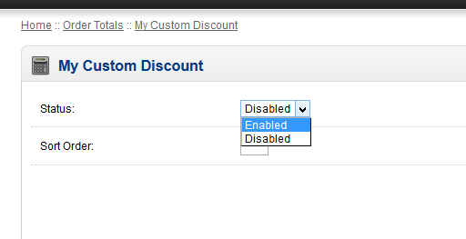

# opencart-custom-discount
Implementing your own (custom) discount in OpenCart e-Commerce Solution.

# Added files:

admin/view/template/total/<b>my_custom_discount.tpl</b> 
admin/controller/total/<b>my_custom_discount.php</b> 
admin/language/english/total/<b>my_custom_discount.php</b> 
 
catalog/model/total/<b>my_custom_discount.php</b> 
catalog/language/english/total/<b>my_custom_discount.php</b>

# Edited files:
<b>Note:</b> For the sake of this example, files I have edited are core files.
You must edit files properly by the use of vQmod and by making your own theme for the template file.
 
If you changed the name of the "admin" folder, then place admin files accordingly.
  
catalog/controller/checkout/cart.php 
catalog/language/english/checkout/cart.php 
catalog/view/theme/default/template/checkout/cart.tpl

#Output

It will be added at the bottom of already existing discount features of OpenCart. 

 
 
When used, you can see that it will automatically reflected in the order total.
 

 
 
Automatically added in order confirmation total as well.
 

 
 
And lastly, it will be included automatically in the admin's order summary as well.
 

# Admin Installation

Before above can be performed, the admin files purpose are to enable the custom discount for use.
So as soon as you completed all the files, log-in to the admin panel and navigate to <b>Extensions->Order Totals</b>.
  
From there you can find what is shown in this screenshot below:
 
You can install/uninstall the extension from here.
 

  
After installing, set to "<b>Enabled</b>" then put the sorting order that should be lesser than the sorting order of the "<b>Total</b>" extension.
 
